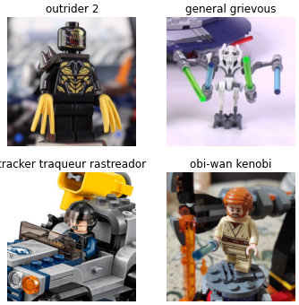
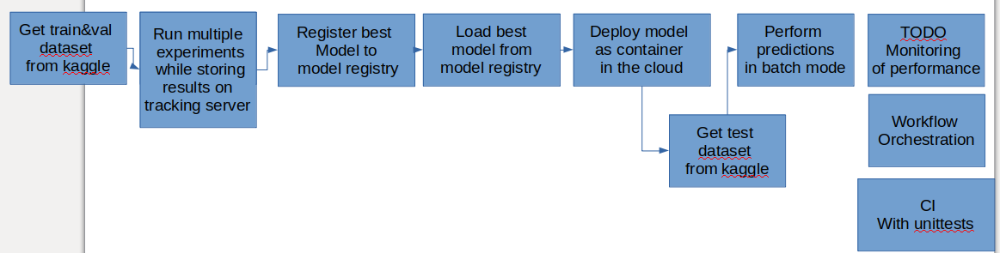
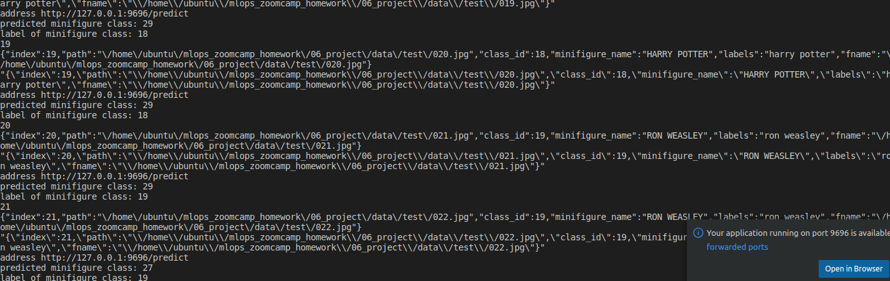

# mlops_zoomcamp_homework
Project of mlops_zoomcamp https://github.com/DataTalksClub/mlops-zoomcamp

# problem description
Your customer is a company which sells minifigures and experiences a high number of returns. Returned minifigures might have an undamaged packaging. Therefore, all minifigures are firstly put in one large box. Your task is now to classify these minifigures to enable the customer to pack the minifigures in the correct new packaging.

## dataset
The dataset contains images from 28 minifigures with more than 300 images. The images were taken in different minifigure poses and environments. The label per image is the name of the minifigure.
Please find the dataset at kaggle: https://www.kaggle.com/datasets/ihelon/lego-minifigures-classification

Here is a sample of it's content including the labels.




# solution overview


# installation
## requirements
1) Please get an AWS S3 bucket to store the mlflow artifacts

2) Run installation of commit-hooks, python packages and environment variables with
    1) prepare setup installation
        ```bash
        sudo apt install make
        ```
    2) ```bash
        sudo apt install make-guile
        ```
    3)
        ```bash
        make setup
        ```
    2) adapt values according to your setup in .env
        ```bash
        nano .env
        ```
        1) enter AWS credentials
        2) enter AWS bucket name

3) Get data from kaggle
    1) download
        * download with script
            1) follow https://www.kaggle.com/general/74235 to create kaggle API key file ~/.kaggle/kaggle.json
            2) use script
                ```bash
                python src/get_data.py
                ```
        * download manually at https://www.kaggle.com/datasets/ihelon/lego-minifigures-classification and copy to 'data' folder
    2) convert .csv files as utf8 (e.g. via VSCode on bottom right, save as utf8)

## recommended
1) faster model training: AWS instance with ca. 8 CPU cores (e.g. running Ubuntu)
2) AWS PostgreSQL database for mlflow server
    * please set your config in the .env file

# get started
1) feeling for dataset: [src/test.ipynb](src/test.ipynb)
    1) link jupyter notebook's kernel to this environment with
        ```bash
        python -m ipykernel install --user --name=mlops_zoomcamp_homework
        ```

2) start mlflow tracking server and train
    * locally with
        1) start local docker environment
            ```bash
            make train
            ```
            TODO: cannot reach http://s3:9001 atm, but model stored to src/modeks\resnet folder

    * (preferred) remotely:
        1) follow steps in mlflow tracking server section
        2) adapt TRACKING_SERVER_HOST in train_model.py with your remote AWS instance for tracking config (note: Here two different instances are used)
        3) edit ~/.aws/config with your aws account settings
        4) run with:
            ```bash
            python src/train_model.py --tracking_server=<YOUR_SERVER>
            ```
3) select best run and tag model as in "Production" stage
    * run notebook [src/get_model_from_registry.jpynb]
    * OR: use GUI at e.g. localhost:80 (or your remote address)
4) deployment streaming and batch mode with docker containers
    1) start docker-compose file in repo root directory with
        ```bash
        docker-compose up -d --build
        ```
        * mlflow registry
        * mongo DB
        * evidently service
    2) ```bash
        docker stop prediction_service
        ```
    4) ```bash
        python prediction_service_stream/app.py
        ```
    5) (use localhost in following variables:
        MONGODB_ADDRESS="mongodb://localhost:27017"
        EVIDENTLY_SERVICE_ADDRESS = os.getenv(
        "EVIDENTLY_SERVICE", "http://localhost:8085")
    6) go to prediction_service folder and run
        ```bash
        python prediction_service_stream/streaming_send_data.py
        ```
    7) resulting in a terminal output like:
    
5) prefect deployment of batch mode
    1) follow setup steps at [mlops zoomcamp notes of orchestration](https://gist.github.com/Qfl3x/8dd69b8173f027b9468016c118f3b6a5#remote-prefect-orion-deployment)
    2) start one run of flow on remote/local system:
        ```bash
        python src/batch_prefect_flow.py --data_path data/test.csv --output_file outputs/batch_prediction.parquet
        ```
    4) configure deployment with:
        ```bash
        prefect deployment create src/batch_prefect_deployment.py
        ```
    5) in prefect UI: create Work Queue with deployment


# content of project
* problem description
* capable of deploying in the cloud
* experiment tracking and model registry
* workflow orchestration with prefect
* model deployment in batch and streaming mode
* basic model monitoring
* best practices
    * testing
        * unittest
        * integration_test
    * linter and code formatter used
    * makefile
    * pre-commit hooks
    * CI pipeline

# other Makefile options
## unittests
execute with
```bash
make unittests
```

## integration_tests
executes following steps:
* code quality check
* unittests
* docker image build
with:
```bash
make integration_test
```


# further installation option
## installation on AWS instance
1) installation, including aws cloud instance and s3 storage (using python 3.9)
    1) ```bash
        sudo apt-get update
        ```
    2) ```bash
        pip install --upgrade pip
        ```
    3) ```bash
        pip3 install pipenv
        ```
    4) ```bash
        sudo apt install awscli
        ```
    5) enter your aws credentials
        ```bash
        aws configure
        ```
    6) ```bash
        sudo install docker-compose
        ```


# credits
1) fastai model trainning: https://www.kaggle.com/code/arbazkhan971/lego-minifigures-classification-for-beginner
2) dataset: https://www.kaggle.com/datasets/ihelon/lego-minifigures-classification
3) MLOps Zoomcamp: https://github.com/DataTalksClub/mlops-zoomcamp

# FAQ
1) issue starting prefect:
    * "AttributeError: module 'typing' has no attribute '_ClassVar'"
        -> ```bash
            pip uninstall dataclassses
        ```
    * alembic.util.exc.CommandError: Can't locate revision identified by
        -> ```bash
            sudo rm ~/.prefect/orion.db
        ```

# TODOs
1) monitoring more beautiful
2) CD (later)
    * terraform
    * CD stage for repo in GitHub
3) streaming in docker container
4) check s3 connection pool full warning for batch_docker.py
